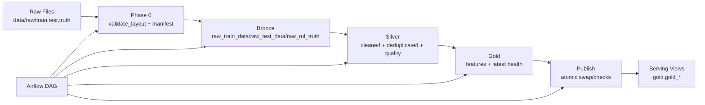

# NASA C-MAPSS Predictive Maintenance Data Platform

Production-ready medallion data pipeline for NASA C-MAPSS turbofan degradation data, built with PostgreSQL, dbt, Airflow, and Python.

## What This Project Delivers

- Bronze/Silver/Gold architecture with deterministic and idempotent processing.
- Operational pipeline orchestration through Airflow (`cmapss_pipeline` DAG).
- Data quality gates in dbt tests before publish.
- Atomic Gold publish strategy with post-publish checks.
- Local reproducible runtime via Docker Compose.

## Architecture



## Tech Stack

- `PostgreSQL 16`
- `dbt-postgres`
- `Apache Airflow 2.9.3`
- `Python` + `psycopg2`
- `Docker Compose`

## Repository Layout

- `airflow/` DAG and custom dbt operator.
- `src/ingestion/` layout validation, manifest generation, Bronze loading.
- `src/ops/` run logging, metrics, Gold publish runner.
- `models/` dbt Silver/Gold models and tests.
- `sql/ddl/` schema/table foundations.
- `sql/publish/` atomic publish SQL and post-publish checks.
- `profiles/` dbt profile for local environment.
- `tests/` pytest suite.

## Quick Start (Local)

### 1) Prerequisites

- Docker Desktop running.
- Python installed.

### 2) Configure environment

```powershell
Copy-Item .env.example .env
```

Default local values (from `.env.example`):

- `PGHOST=localhost`
- `PGPORT=5432`
- `PGDATABASE=cmapss`
- `PGUSER=cmapss`
- `PGPASSWORD=cmapss`

### 3) Install Python dependencies

```powershell
python -m pip install -r requirements.txt
```

### 4) Start core services

```powershell
docker compose --env-file .env up -d postgres airflow-init airflow-webserver airflow-scheduler
docker compose ps
```

Airflow UI: [http://localhost:8080](http://localhost:8080)  
Default credentials: `admin / admin`

## Run Pipeline Steps Manually

### Data organization gate (Phase 0)

```powershell
python src/ingestion/validate_layout.py
python src/ingestion/build_manifest.py
```

### Bronze ingestion

```powershell
python src/ingestion/load_bronze.py
```

### dbt build + docs

```powershell
dbt deps --project-dir .
dbt build --project-dir . --profiles-dir profiles --fail-fast
dbt docs generate --project-dir . --profiles-dir profiles
```

### Publish Gold serving objects

```powershell
python src/ops/publish_gold.py
```

## Airflow Orchestration

Trigger DAG: `cmapss_pipeline`

Task order:

1. `validate_layout`
2. `build_manifest`
3. `load_bronze`
4. `dbt_build`
5. `dbt_docs`
6. `publish_views`

Retries are enabled for robust execution (`retries=3` in DAG defaults).

## Validation and Tests

### Python tests

```powershell
python -m pytest -q
```

### dbt data quality

Quality gates are defined in:

- `models/silver/schema.yml`
- `models/gold/schema.yml`

## CI Status

CI workflow exists at `.github/workflows/ci.yml` and is currently **manual only** (`workflow_dispatch`).

## Troubleshooting

- If Airflow webserver does not restart cleanly, ensure stale PID cleanup is applied by Compose command.
- If `dbt` command is not recognized on host, run inside container or ensure Python Scripts path is in `PATH`.
- If local `psql` auth fails, check `PG*` environment variables and use explicit connection arguments.
- On PowerShell, avoid shell redirection patterns intended for bash (`< file.sql`); use `Get-Content ... | ...` or `-f`.

## Next Steps

See `NEXT_STEPS.md` for the full runbook, hardening checklist, and release flow.
